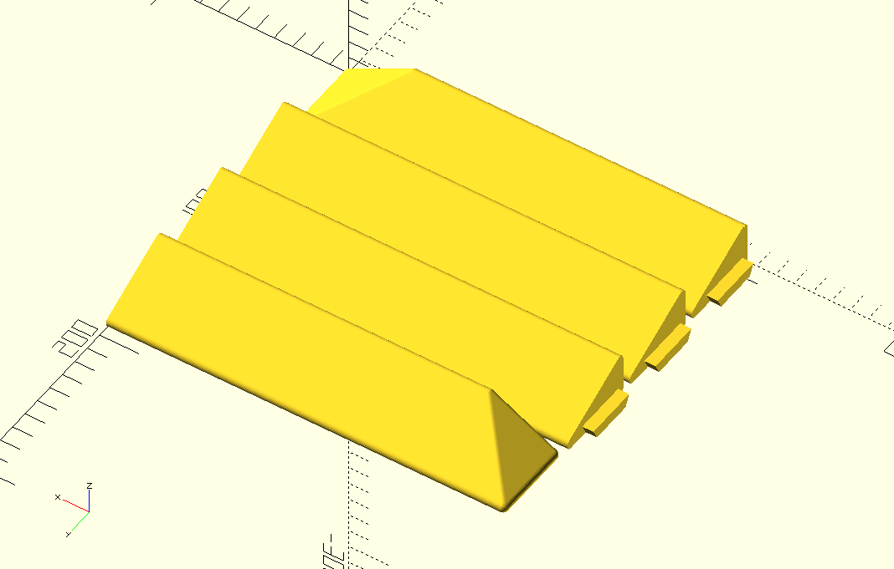
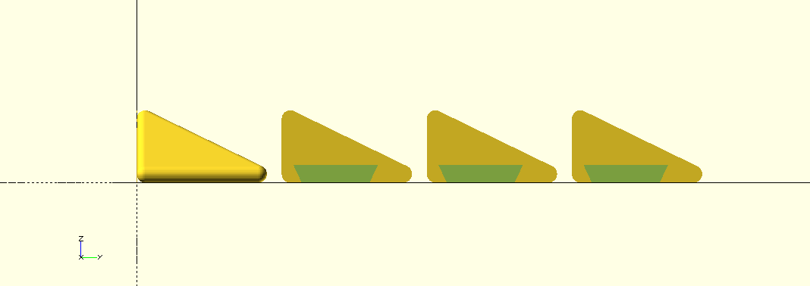

3D model ramp for Roomba
===============

Implemeted in OpenSCAD.

Has parameters of height, width, and lenght.

Also adgasted for printer bed size. The ramp is cut into several parts.
Ends of the ramp have same slope as the main body and directed towards the length.

